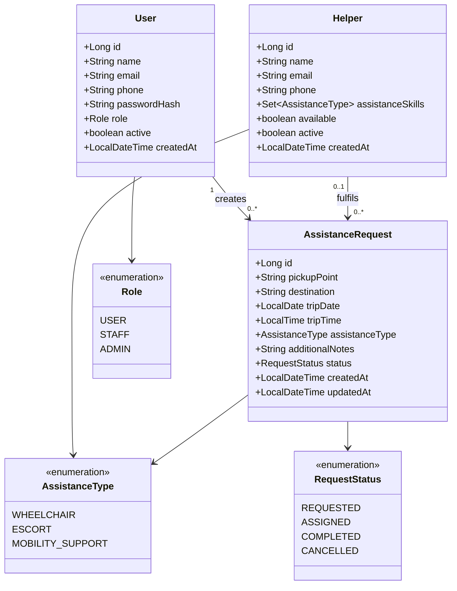
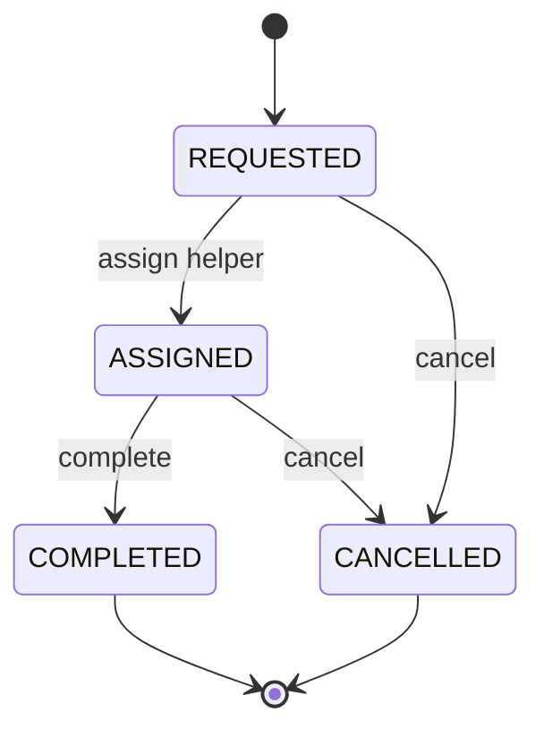

# Class Diagram

```mermaid
classDiagram
    class User {
        +Long id
        +String name
        +String email
        +String phone
        +String passwordHash
        +Role role
        +boolean active
        +LocalDateTime createdAt
    }
    class Helper {
        +Long id
        +String name
        +String email
        +String phone
        +Set~AssistanceType~ assistanceSkills
        +boolean available
        +boolean active
        +LocalDateTime createdAt
    }
    class AssistanceRequest {
        +Long id
        +String pickupPoint
        +String destination
        +LocalDate tripDate
        +LocalTime tripTime
        +AssistanceType assistanceType
        +String additionalNotes
        +RequestStatus status
        +LocalDateTime createdAt
        +LocalDateTime updatedAt
    }
    class Role {
        <<enumeration>>
        USER
        STAFF
        ADMIN
    }
    class AssistanceType {
        <<enumeration>>
        WHEELCHAIR
        ESCORT
        MOBILITY_SUPPORT
    }
    class RequestStatus {
        <<enumeration>>
        REQUESTED
        ASSIGNED
        COMPLETED
        CANCELLED
    }
    User "1" --> "0..*" AssistanceRequest : creates
    Helper "0..1" --> "0..*" AssistanceRequest : fulfils
    User --> Role
    Helper --> AssistanceType
    AssistanceRequest --> AssistanceType
    AssistanceRequest --> RequestStatus
```

## Status transitions

```mermaid
stateDiagram-v2
    [*] --> REQUESTED
    REQUESTED --> ASSIGNED : assign helper
    REQUESTED --> CANCELLED : cancel
    ASSIGNED --> COMPLETED : complete
    ASSIGNED --> CANCELLED : cancel
    COMPLETED --> [*]
    CANCELLED --> [*]
```

`COMPLETED` and `CANCELLED` are final. The table is implemented in `RequestStatus.canTransitionTo(...)`.
